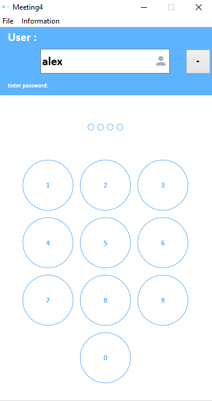

# Meeting4_Desktop

`Meeting4` is a complete Software Solution for Management appointments.

**Authors:**  *WalWalWalides*
------

The Software offers a new Way for better Management team appointments. That means granting increased Productivity - That promises more and better Work in less Time.

`Meeting4` simplifies service Storing and Organization, enables optimal Staffing,and you can use with different DAW Software.

Principal Software Benefits:

      - Send and Receive Data from app

      - Flexible and Powerful User Interface.

      - Efficient Packages and resource Planning,storing.

      - Strong resource Management and capacity Planning.
      
      - Backup and Recovery.

    
    

## Contains

| Module | Name | 
| --- | --- |
|Meeting4.exe|Management team appointments|

------

## To Install the Software:

### Install application 

Download Link For Meeting4 : https://github.com/walwalwalides/Meeting4/releases/download/V1.0.0/Meeting4__Setup.exe

------

### Demo

# If You Want To Donate!

