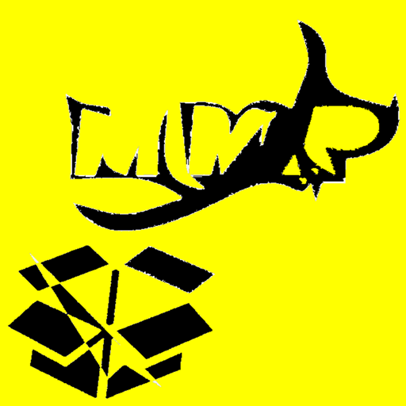

# MMP_Mobile (ANDROID)

`MMP_Mobile` is a Android Data Transfer Apps to Switch Packages Easily..

**Authors:**  *WalWalWalides*
------

The Android App offers a new Way for better transfer WAV packages. That means granting increased Productivity - That promises more and better Work in less Time.

`MMP_Mobile` simplifies service Storing and Organization, enables optimal Staffing,and you can use with different DAW ( Digital Audio Workstation) Software.

The App are designed to use UDP or TCP Protocol depending on your requirements.

Principal Software Benefits:

      - Flexible and Powerful User Interface.

      - Efficient Packages and resource Planning,storing.

      - Strong resource Management and capacity Planning.      
      
      - Backup and Recovery.
      
      - Less Network Traffic.
      
      - Offer two transport layer protocol TCP and UDP.

    
    

## Contains

| Module | Name | 
| --- | --- |
|MMP_Mobile.apk|Music Management Packages(Android) |

------

## To Install the Software:

### Install App ( ANDROID ) 

Link : https://github.com/walwalwalides/MMP_Collection/releases/download/V1.0.0/MMP_Mobile.apk

# If You Want To Donate!

