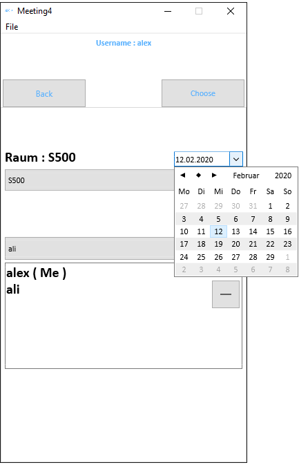

# Meeting4_Mobile (ANDROID)

`Meeting4_Mobile` is a Android App for Management team appointments.

**Authors:**  *WalWalWalides*
------

The Android App offers a new Way for better Management team appointments. That means granting increased Productivity - That promises more and better Work in less Time.

`Meeting4_Mobile` simplifies service Storing and Organization, enables optimal Staffing,and you can use with different Software.

Principal Software Benefits:

      - Flexible and Powerful User Interface.

      - Efficient Packages and resource Planning,storing.

      - Strong resource Management and capacity Planning.      
      
      - Backup and Recovery.
      
      - Less Network Traffic.
      
      - Automated communication.

    
    

## Contains

| Module | Name | 
| --- | --- |
|Meeting4.apk|Management team appointments (Android)|

------

## To Install the Software:

### Install App ( ANDROID ) 

Link : https://github.com/walwalwalides/Meeting4/releases/download/V1.0.1/Meeting4.apk

# If You Want To Donate!

